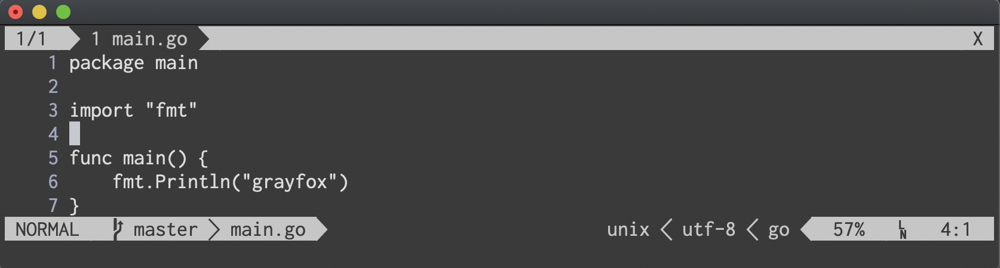

# lightline-grayfox

## Status bar color scheme for [lightline.vim](https://github.com/itchyny/lightline.vim)

## How to use

if you use [dein.vim](https://github.com/Shougo/dein.vim) ...

```toml
[[plugins]]
repo = 'NasSilverBullet/lightline-grayfox'

[[plugins]]
repo = 'itchyny/lightline.vim'
depends = 'lightline-grayfox'
hook_add = '''
  let g:lightline = {
    \   'colorscheme': 'grayfox',
    ...
```

if you want to use transparent mode, append ...

```vim
g:grayfox_is_transparent = 1
```

## Screen Shot



## License

MIT License. See LICENSE.txt for more information.
